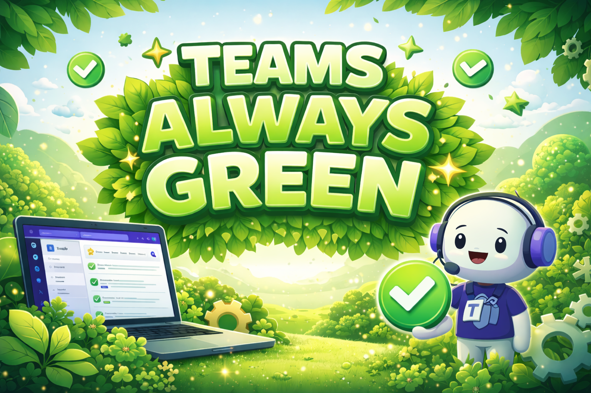
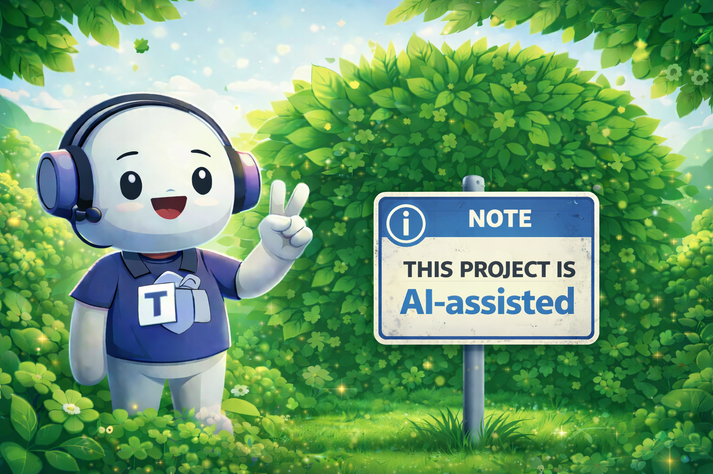

<p align="center">
  
</p>

#  Teams Always Green

[](https://github.com/alexphillips-dev/Teams-Always-Green/releases/latest)
[](LICENSE)
[](README.md#requirements)
[](README.md#requirements)

Teams Always Green is a bare-bones Windows tray app that keeps Microsoft Teams presence active by periodically tapping Scroll Lock without leaving Scroll Lock enabled.

## Purpose

Teams Always Green is not designed for malicious use or to help anyone avoid work. It was created after experiencing a workplace where Microsoft Teams presence was treated as a proxy for productivity while working from home. Even when the work was getting done, an automatic `Away` status could lead to unnecessary questions or assumptions. This app is meant to reduce that kind of false signal by keeping presence steady during legitimate work, meetings, reading, calls, and other hands-off tasks.

## What It Does

- Runs quietly from the Windows notification area.
- Shows a green tray icon while running and a red tray icon while stopped.
- Provides a right-click tray menu for status, next run, last run, Start/Stop, Run Once Now, Restart, and Exit.
- Taps Scroll Lock every 60 seconds while running.
- Writes simple dated logs under `%LOCALAPPDATA%\TeamsAlwaysGreen\Logs`.

## Requirements

- Windows 10 or Windows 11
- Windows PowerShell 5.1

## Run

Double-click:

```text
Teams Always Green.VBS
```

That launcher starts the PowerShell tray app hidden, with no console window.

To run it directly from PowerShell:

```powershell
powershell.exe -NoProfile -ExecutionPolicy RemoteSigned -File "app\runtime\Teams Always Green.ps1"
```

## Usage

Right-click the tray icon:

- `Status`: shows whether the app is running or stopped.
- `Next run`: shows the countdown until the next automatic tap.
- `Last run`: shows the last tap time.
- `Start` / `Stop`: enables or disables automatic tapping.
- `Run Once Now`: performs one immediate tap.
- `Restart`: relaunches the app.
- `Exit`: closes the tray app.

## Install Notes

There is no installer in this bare-bones version. Keep the folder wherever you want to run it from and launch `Teams Always Green.VBS`.

To start with Windows, create a shortcut to `Teams Always Green.VBS` in:

```text
%APPDATA%\Microsoft\Windows\Start Menu\Programs\Startup
```

## Files

```text
Teams Always Green\
  Teams Always Green.VBS
  app\
    runtime\
      Teams Always Green.ps1
  assets\
    icons\
      Tray_Icon.ico
    readme\
      Banner.png
      AI_Assisted_Banner.png
  LICENSE
  README.md
  VERSION
```

## Uninstall

1. Exit the app from the tray icon.
2. Delete the app folder.
3. If you added a Startup shortcut, delete that shortcut.
4. Optional: delete logs from `%LOCALAPPDATA%\TeamsAlwaysGreen`.

---

<p align="center">
  
</p>

## Development Transparency

This project is AI-assisted. AI tooling is used to help draft, refactor, test, and document changes, with final direction and release decisions kept human-led.

## License

MIT License. See `LICENSE`.
